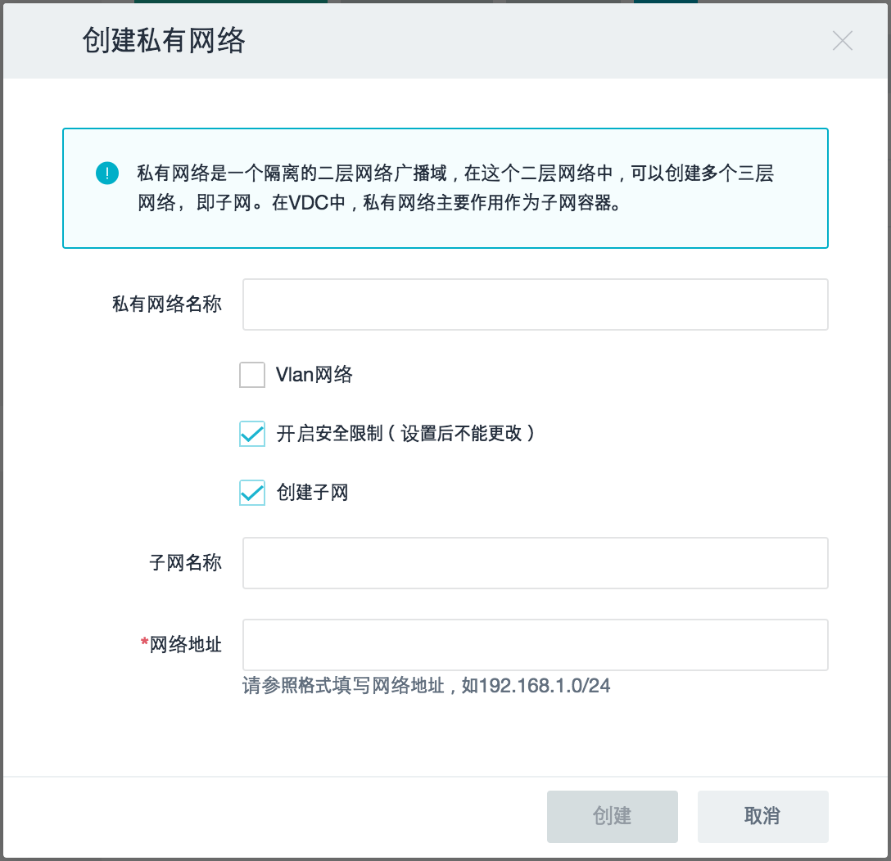

## 弹窗配置

弹窗是点击面板的按钮之后弹出的交互界面。一般分为默认弹窗的和自定义的弹窗，自定义的弹窗样式可以直接写入样式，在这里介绍默认弹窗为用config文件写出的界面，不需要额外写样式，以下是一个弹窗示例。

<p style="text-align: center">
  
</p>

视图部分的配置文件以`kunkka/halo/client/dashboard/modules/network/pop/create_network/config.json`文件举例。

``` json
{
  "title": ["create", "prv_network"],      //弹窗的title，自动拼接i18n
  "fields": [{
    "type": "tip",                         //提示提示框类型的组件
    "tip_type": "info",                    //tip_type
    "field": "prv_info"                    //该组件label的i18n，也是该组件的ref名称
  }, {
    "type": "input",                       //input类型的组件
    "field": "network_name",
    "is_long_label": true                  //是否长label类型
  }, {
    "type": "checkbox",                    //checkbox类型的组件
    "field": "enable_vlan",
    "checked": false,                      //默认初始状态是否选中
    "has_long_label": true
  },{
    "type": "input",
    "field": "vlan_id",
    "is_long_label": true,
    "hide": true,
    "tip_info": "vlan_tip"
  }, {
    "type": "checkbox",
    "field": "enable_security",
    "checked": true,
    "has_long_label": true
  }, {
    "type": "checkbox",
    "field": "create_subnet",
    "checked": true,
    "has_long_label": true
  }, {
    "type": "input",
    "field": "subnet_name",
    "is_long_label": true
  }, {
    "type": "input",
    "field": "net_address",
    "is_long_label": true,
    "tip_info": "cidr_tip",                //带有提示文字的input文字框
    "required": true                       //是否为必填项，如果是且没有内容，则点击确认按钮会报错
  }],
  "btn": {
    "value": "create",                     //确认按钮的i18n文字
    "type": "create",                      //button的type，有create，delete，warning，cancel
    "disabled": true                       //默认初始状态是否禁用
  }
}
```

逻辑部分的代码以`kunkka/halo/client/dashboard/modules/network/pop/create_network/index.js`文件举例。

``` javascript
var commonModal = require('client/components/modal_common/index');
var config = require('./config.json');
var request = require('../../request');
var __ = require('locale/client/dashboard.lang.json');

function pop(parent, callback) {                //parent为父级弹窗，callback回调函数需要在confirm之后执行
  if (!HALO.settings.is_show_vlan) {            //根据情况判断vlan_id组件是否隐藏
    config.fields[2].hide = true;
  }

  var props = {
    __: __,                                     //i18n对象
    parent: parent,                             //父级弹窗，若没有可以写null
    config: config,                             //等同于上面的config.json
    onInitialize: function(refs) {},            //初始化时需要的逻辑写入onInitialize函数，refs为config中所有组件的引用组合
    onConfirm: function(refs, cb) {             //在点击确认按钮之后的逻辑
      var data = {                              //点击onConfirm之后确认按钮会变成disabled状态，并且执行该函数的代码
        name: refs.network_name.state.value
      };

      /*
        省略代码
      */

      request.createNetwork(data).then((res) => {
        callback && callback(res.network);
        cb(true);                              //onConfirm有cb参数：当传递true时关闭弹窗；若传递false，确认按钮变成非disabled状态，可以重新点击
      });
    },
    onAction: function(field, status, refs) {   //field为当前发生变化的组件名称，status为当前发生变化的组件的value，refs为所有组件的引用组合
      var subnetChecked = refs.create_subnet.state.checked;
      switch (field) {
        case 'create_subnet':                //以下代码为当create_subnet组件值发生变化时其他组件的视图如何变化
          refs.subnet_name.setState({
            hide: !subnetChecked
          });
          refs.net_address.setState({
            hide: !subnetChecked
          });
          refs.btn.setState({
            disabled: subnetChecked
          });
          break;

        /*
          省略代码
        */

        default:
          break;
      }
    }
  };

  commonModal(props);                       //把参数传给commonModal执行
}

module.exports = pop;
```

更多组件和属性可以在`kunkka/halo/client/components/modal_common/subs`中查看。